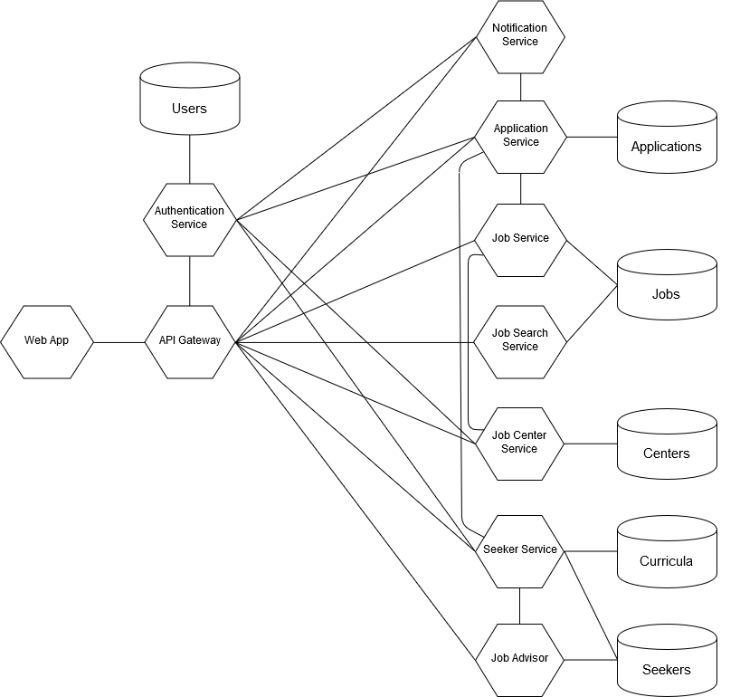

# Progetto TASD

This project aims to build an application for search and apply job offers, built with a microservice architecture.

# Architecture


The service API Gateway is the service responsible of dispatching web requests, authentication, authorization and filtering, and exposes application's API.  
The service Job Center is the service responsible of managing job centers, and exposes CRUD API for jobs centers.  
The service Job is the service responsible of managing job insertions, and exposes CRUD API for job insertions.  
The service Job Seeker is the service responsible of browsing job insertions, and exposes API for job search.  
The service Application is the service responsible of managing users' applications to jobs, and exposes CRUD API for managing applications.  
The service Notification is the service responsible of notifying users of application confirmation and new job insertions, and exposes API to send emails using Google Mail API.  
The service Job Advisor is the service responsible of computing skills-based suggestions, and exposes API to provide job suggestions to the seeker.  
The service Seeker is the service responsible of managing users, and exposes CRUD API for users.  

## Run

### Prerequisites

To run the whole application, a docker machine with at least 6500 MB of RAM is needed.
It is also recommended to set at least 4 GB of RAM to the docker deamon.

### Installing

To run the application, first clone git repository and `cd` into the docker folder inside the project and finally run `docker-compose`:

```
git clone https://github.com/AndreJackBia/progetto-tasd.git
cd progetto-tasd/docker
docker-compose up
```

## Built With

* [Spring Boot](https://spring.io/projects/spring-boot)
* [Maven](https://maven.apache.org/)
* [Docker](https://www.docker.com/) 
* [Flask](https://flask.pocoo.org/)
* [Postgres](https://www.postgresql.org/)

## Authors

* **Andrea Biaggi** - 794873
* **Matteo Costantini** - 795125
* **Lorenzo Di Vito** - 793128
* **Dario Gerosa** - 793636

## License

This project is licensed under the MIT License - see the [LICENSE](LICENSE) file for details

